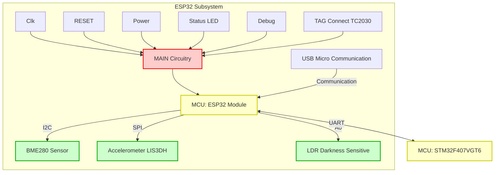

```mermaid
flowchart TD
    %% Define classes at the top
    classDef mainCirc fill:#ffcccc,stroke:#ff0000,stroke-width:2px
    classDef mcu fill:#ffffcc,stroke:#cccc00,stroke-width:2px
    classDef digital fill:#ccffcc,stroke:#00aa00,stroke-width:2px
    classDef flash fill:#ccffff,stroke:#00aaaa,stroke-width:2px

    subgraph ESP32_System["ESP32 Subsystem"]
        %% Top Row Inputs
        Clk1["Clk"]
        Rst1["RESET"]
        Pwr1["Power"]
        n2["Status LED"]
        n3["Debug"]
        TC["TAG Connect TC2030"]

        Main1["MAIN Circuitry"]:::mainCirc

        %% Connect inputs to Main Circuitry
        Clk1 --> Main1
        Rst1 --> Main1
        Pwr1 --> Main1
        n2 --> Main1
        n3 --> Main1
        TC --> Main1

        %% MCU and USB
        ESP32_MCU["MCU: ESP32 Module"]:::mcu
        USB["USB Micro Communication"]
        
        Main1 --> ESP32_MCU
        USB -- Communication --> ESP32_MCU

        %% Peripherals
        BME["BME280 Sensor "]:::digital
        LIS["Accelerometer LIS3DH "]:::digital
        n1["LDR Darkness Sensitive"]:::digital

        ESP32_MCU -- I2C --> BME
        ESP32_MCU -- SPI --> LIS
        ESP32_MCU -- A0 --> n1
    end

    %% External System
    STM32_MCU["MCU: STM32F407VGT6"]:::mcu
    
    %% Inter-system communication
    ESP32_MCU <-->|UART| STM32_MCU
```